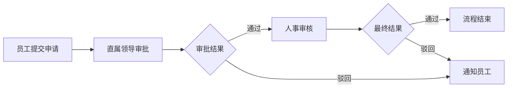
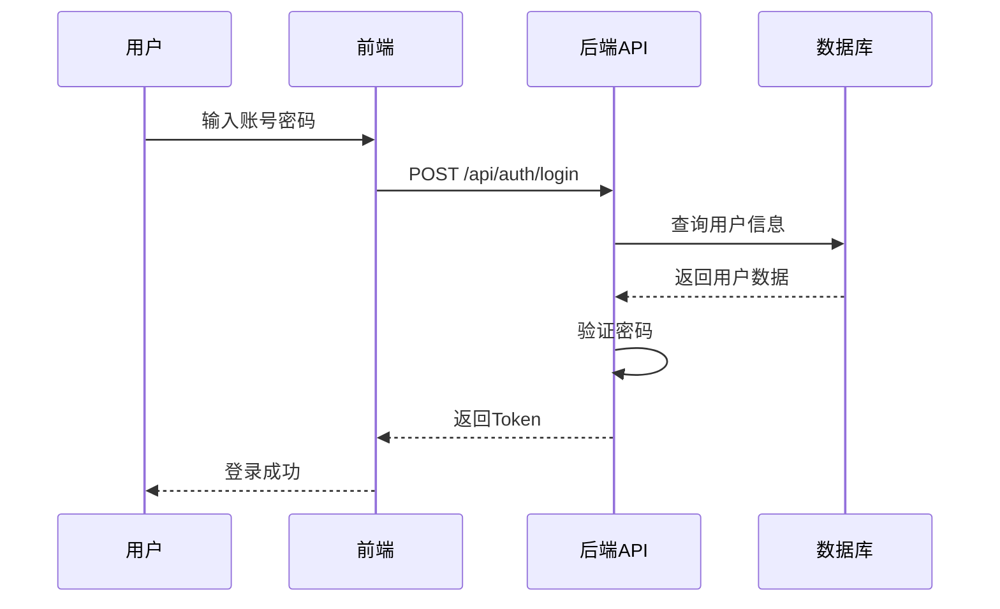

# Markdown文档编写辅助

提供Markdown文档编写过程中的图表生成、格式检查、目录生成等辅助功能。

## 使用方法

当用户说以下内容时触发：
- "生成流程图"、"生成时序图"、"生成结构图"
- "生成模块图"、"生成泳道图"
- "检查markdown格式"、"修复格式"
- "生成目录"、"更新目录"
- "插入图表"、"添加图片"

## 核心功能

### 1. 图表生成（Mermaid）

#### 支持的图表类型

| 图表类型 | Mermaid关键字 | 使用场景 |
|---------|--------------|---------|
| 流程图 | `graph`/`flowchart` | 业务流程、审批流程 |
| 时序图 | `sequenceDiagram` | 系统交互、API调用 |
| 类图 | `classDiagram` | 数据模型、类结构 |
| 状态图 | `stateDiagram` | 状态流转 |
| 实体关系图 | `erDiagram` | 数据库设计 |
| 用户旅程 | `journey` | 用户体验流程 |
| 甘特图 | `gantt` | 项目计划 |
| 思维导图 | `mindmap` | 知识体系、功能结构 |
| 饼图 | `pie` | 数据占比 |
| 泳道图 | `graph`+子图 | 跨部门流程 |

#### 执行流程

**步骤1：生成Mermaid代码**

根据用户需求生成对应的Mermaid代码。

**步骤2：保存为.mmd文件**

```bash
# 保存到临时文件
temp_file="temp_diagram_$(date +%s).mmd"
cat > "$temp_file" << 'EOF'
[Mermaid代码内容]
EOF
```

**步骤3：转换为PNG图片**

```bash
# 确保images目录存在
mkdir -p images

# 转换为PNG（透明背景，3倍缩放保证清晰度）
mmdc -i "$temp_file" -o "images/diagram-$(date +%s).png" -b transparent -s 3

# 清理临时文件
rm -f "$temp_file"
```

**步骤4：插入图片引用**

在markdown文档中插入：

```markdown

```

#### 图表样式规范

**颜色方案**（Ant Design色系）：

| 用途 | 背景色 | 边框色 | 文字色 |
|------|--------|--------|--------|
| 核心节点 | `#1890ff` (蓝) | `#096dd9` | `#fff` |
| 业务模块 | `#52c41a` (绿) | `#389e0d` | `#fff` |
| 警告/注意 | `#faad14` (橙) | `#d48806` | `#fff` |
| 错误/危险 | `#f5222d` (红) | `#cf1322` | `#fff` |
| 信息/提示 | `#13c2c2` (青) | `#08979c` | `#fff` |
| 普通节点 | `#ffffff` (白) | `#d9d9d9` | `#000` |

**样式模板**：

```mermaid
style NodeID fill:#背景色,color:#文字色,stroke:#边框色,stroke-width:2px,font-size:16px
```

### 2. 格式检查与修正

#### 检查项（根据CLAUDE.md规范）

**三大核心规则**：
1. 标题必须顶格，无前导空格
2. 标题前必须有空行
3. 章节编号要统一连续

**其他检查项**：
- 列表格式正确
- 表格前后有空行
- 文件编码为UTF-8
- 无不必要的行尾空格

#### 执行命令

```bash
# 检查标题缩进
grep -n "^ #" file.md | grep -v "^#"

# 检查空行问题
# 使用Read工具人工检查
```

### 3. 目录生成

#### 自动生成目录

```markdown
## 目录

- [1 简介](#1-简介)
  - [1.1 目的](#11-目的)
  - [1.2 范围](#12-范围)
- [2 总体概述](#2-总体概述)
  ...
```

**生成规则**：
- 锚点自动生成：标题中的空格替换为连字符
- 使用缩进表示层级关系
- 只包含2级和3级标题

### 4. 图片管理

#### 图片路径规范

```markdown
# 当前文档在：项目文档/XXX系统/XX_需求规格说明书/需求规格说明书.md
# 图片存放：项目文档/images/
# 相对路径：../../../images/xxx.png
```

#### 图片命名规范

```
[项目名]-[图表类型]-[序号].png

例如：
HR-System-function-structure.png
HR-System-flow-001.png
```

## 使用示例

### 示例1：生成功能结构图

**用户输入**：
```
生成人力资源管理系统功能结构图，包含首页、员工管理、部门管理、考勤管理、薪资管理、招聘管理、绩效管理、审批管理、系统管理
```

**执行步骤**：
1. 生成Mermaid代码（mindmap或graph类型）
2. 转换为PNG图片
3. 在文档中插入图片引用

### 示例2：生成审批流程图

**用户输入**：
```
生成请假审批流程图：员工提交申请 -> 直属领导审批 -> 人事审核 -> 审批通过/驳回
```

**Mermaid代码**：


### 示例3：生成系统时序图

**用户输入**：
```
生成用户登录时序图：用户 -> 前端 -> 后端API -> 数据库
```

**Mermaid代码**：


## 注意事项

### Mermaid CLI环境要求

**首次使用需要安装**：
```bash
# 安装mermaid-cli
npm install -g @mermaid-js/mermaid-cli@10.9.0

# 安装Chrome浏览器
cd /d/MyDocument/documents
npm install puppeteer@19.11.1
node node_modules/puppeteer/install.js
```

### 图片清晰度调整

```bash
# 低清晰度（快速预览）
mmdc -i input.mmd -o output.png -s 1

# 中等清晰度（默认）
mmdc -i input.mmd -o output.png -s 2

# 高清晰度（文档使用）
mmdc -i input.mmd -o output.png -s 3

# 超高清晰度（打印）
mmdc -i input.mmd -o output.png -s 4
```

### 背景色选择

```bash
# 透明背景（推荐，适合任何主题）
-b transparent

# 白色背景（适合浅色主题）
-b white

# 灰色背景（适合深色主题）
-b #1e1e1e
```

### 临时文件清理

每次执行完图表生成后，自动清理：
```bash
rm -f temp_diagram*.mmd
rm -rf tmpclaude-*-cwd
```

## 退出条件

当完成以下任一操作时，结束skill执行：
1. 成功生成并插入图片
2. 完成格式检查并修正
3. 完成目录生成
4. 用户明确表示满意或要求停止
