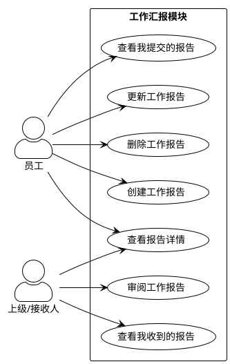
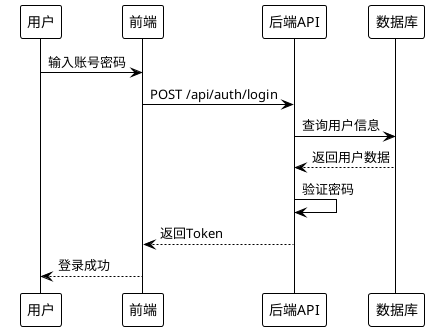
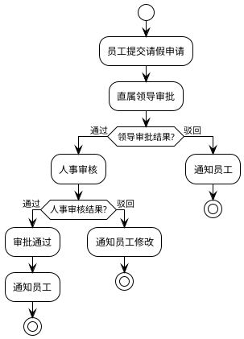
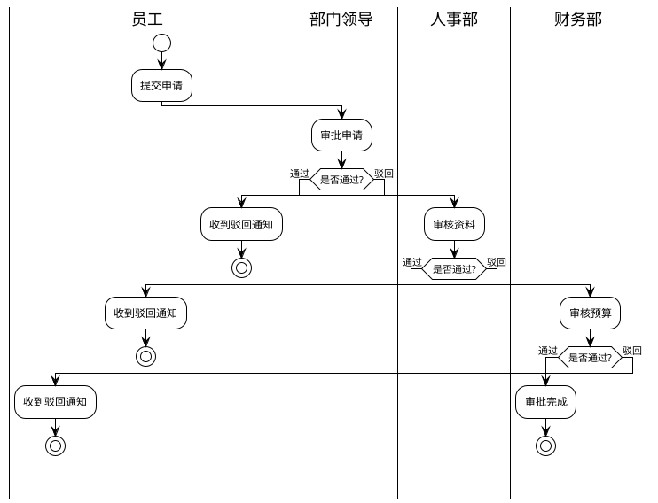
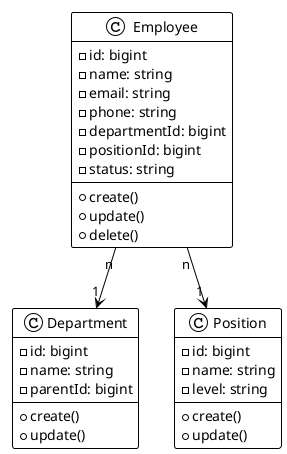
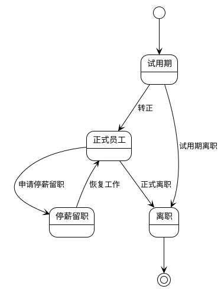

# Markdown文档编写辅助

提供Markdown文档编写过程中的UML图表生成、格式检查、目录生成等辅助功能。

## 使用方法

当用户说以下内容时触发：
- "生成用例图"、"生成流程图"、"生成时序图"
- "生成类图"、"生成活动图"、"生成泳道图"
- "生成状态图"、"生成组件图"
- "检查markdown格式"、"修复格式"
- "生成目录"、"更新目录"
- "插入图表"、"添加图片"

## 图表工具选择指南

### PlantUML vs Mermaid

本 skill 主要使用 **PlantUML** 生成 UML 建模图，但 **Mermaid** 和 **PlantUML** 可以互补使用，根据具体需求选择合适的工具。

#### 工具对比

| 特性 | PlantUML | Mermaid |
|------|----------|---------|
| **用例图** | ✅ 完整支持 | ❌ 不支持 |
| **类图** | ✅ 完整支持 | ⚠️ 基础支持 |
| **时序图** | ✅ 完整支持 | ✅ 完整支持 |
| **活动图/流程图** | ✅ 活动图 | ✅ 流程图（更简洁） |
| **状态图** | ✅ 完整支持 | ✅ 完整支持 |
| **思维导图** | ❌ 不支持 | ✅ 支持 |
| **甘特图** | ✅ 支持 | ✅ 支持 |
| **ER图** | ✅ 支持 | ✅ 支持 |
| **UML标准** | ✅ 完全符合 | ⚠️ 部分符合 |
| **在线渲染** | ⚠️ 需要服务器 | ✅ GitHub/GitLab原生支持 |
| **转PNG** | ✅ 在线服务（本skill） | ⚠️ 需要CLI工具 |
| **语法复杂度** | ⚠️ 较复杂 | ✅ 简单易学 |

#### 使用建议

**使用 PlantUML（本skill默认）**：
- 📐 **标准UML建模图**：用例图、类图、组件图、部署图
- 📄 **正式项目文档**：需求规格说明书、设计文档
- 🏢 **企业级文档**：需要符合UML标准
- 🎯 **复杂系统架构**：多层次的系统设计

**使用 Mermaid（需要单独处理）**：
- 📝 **GitHub/GitLab文档**：README.md、Wiki（原生支持）
- 💡 **快速流程图**：业务流程、决策树
- 🧠 **思维导图**：知识体系、功能结构
- 📊 **数据可视化**：甘特图、饼图
- 🔄 **版本控制友好**：纯文本，易于diff

#### 选择流程

```
需要生成图表
    ↓
是否需要标准UML图（用例图/类图）？
    ├─ 是 → 使用 PlantUML（本skill）
    └─ 否 → 是否在GitHub/GitLab上展示？
            ├─ 是 → 使用 Mermaid（直接在Markdown中）
            └─ 否 → 是否需要思维导图/甘特图？
                    ├─ 是 → 使用 Mermaid
                    └─ 否 → 两者皆可，PlantUML更标准
```

#### 注意事项

- **本skill默认使用PlantUML**，适合正式文档和UML建模
- **Mermaid适合快速绘图**，特别是在GitHub等平台上
- **两者可以在同一项目中混用**，根据具体场景选择
- **如需使用Mermaid**，可以直接在Markdown中编写，无需转换为PNG

## 核心功能

### 1. UML图表生成（PlantUML）

#### 支持的图表类型

| 图表类型 | PlantUML关键字 | 使用场景 |
|---------|--------------|---------|
| 用例图 | `@startuml` + `usecase` | 系统功能、用户交互 |
| 时序图 | `@startuml` + `participant` | 系统交互、API调用 |
| 类图 | `@startuml` + `class` | 数据模型、类结构 |
| 活动图 | `@startuml` + `start`/`stop` | 业务流程、审批流程 |
| 状态图 | `@startuml` + `state` | 状态流转 |
| 组件图 | `@startuml` + `component` | 系统架构 |
| 部署图 | `@startuml` + `node` | 部署架构 |
| 对象图 | `@startuml` + `object` | 对象关系 |
| 泳道图 | `@startuml` + `|泳道名|` | 跨部门流程 |

#### 执行流程

**步骤1：生成PlantUML代码**

根据用户需求生成对应的PlantUML代码。

**步骤2：保存为.puml文件**

将PlantUML代码保存到scripts目录：

```bash
# 确保scripts目录存在
mkdir -p scripts

# 保存到临时文件
cat > "scripts/temp_diagram_$(date +%s).puml" << 'EOF'
@startuml
[PlantUML代码内容]
@enduml
EOF
```

**步骤3：使用Node.js脚本转换为PNG图片**

使用通用转换脚本 `scripts/plantuml-to-png.js`：

```javascript
// 该脚本会：
// 1. 读取.puml文件
// 2. 压缩并编码为PlantUML格式
// 3. 调用PlantUML在线服务生成PNG
// 4. 保存到images目录
```

执行命令：

```bash
# 转换单个文件
node scripts/plantuml-to-png.js scripts/temp_diagram.puml images/output.png

# 或使用批量转换
node scripts/plantuml-to-png.js scripts/*.puml
```

**步骤4：清理临时文件**

```bash
# 清理临时.puml文件
rm -f scripts/temp_diagram*.puml
```

**步骤5：插入图片引用**

在markdown文档中插入：

```markdown

```

#### PlantUML样式规范

**主题设置**：

```plantuml
@startuml
!theme plain
skinparam actorStyle awesome
skinparam packageStyle rectangle
@enduml
```

**颜色方案**（Ant Design色系）：

| 用途 | 背景色 | 边框色 | 文字色 |
|------|--------|--------|--------|
| 核心节点 | `#1890ff` (蓝) | `#096dd9` | `#fff` |
| 业务模块 | `#52c41a` (绿) | `#389e0d` | `#fff` |
| 警告/注意 | `#faad14` (橙) | `#d48806` | `#fff` |
| 错误/危险 | `#f5222d` (红) | `#cf1322` | `#fff` |
| 信息/提示 | `#13c2c2` (青) | `#08979c` | `#fff` |
| 普通节点 | `#ffffff` (白) | `#d9d9d9` | `#000` |

**样式模板**：

```plantuml
skinparam rectangle {
    BackgroundColor #1890ff
    BorderColor #096dd9
    FontColor #fff
}
```

### 2. 格式检查与修正

#### 检查项（根据CLAUDE.md规范）

**三大核心规则**：
1. 标题必须顶格，无前导空格
2. 标题前必须有空行
3. 章节编号要统一连续

**其他检查项**：
- 列表格式正确
- 表格前后有空行
- 文件编码为UTF-8
- 无不必要的行尾空格

#### 执行命令

```bash
# 检查标题缩进
grep -n "^ #" file.md | grep -v "^#"

# 检查空行问题
# 使用Read工具人工检查
```

### 3. 目录生成

#### 自动生成目录

```markdown
## 目录

- [1 简介](#1-简介)
  - [1.1 目的](#11-目的)
  - [1.2 范围](#12-范围)
- [2 总体概述](#2-总体概述)
  ...
```

**生成规则**：
- 锚点自动生成：标题中的空格替换为连字符
- 使用缩进表示层级关系
- 只包含2级和3级标题

### 4. 图片管理

#### 图片路径规范

```markdown
# 当前文档在：项目文档/XXX系统/XX_需求规格说明书/需求规格说明书.md
# 图片存放：项目文档/images/
# 相对路径：../../../images/xxx.png
```

#### 图片命名规范

```
[项目名]-[图表类型]-[序号].png

例如：
HR-System-usecase-01.png
HR-System-sequence-01.png
HR-System-activity-01.png
```

## PlantUML图表示例

### 示例1：用例图

**用户输入**：
```
生成工作汇报模块用例图，包含员工和上级两个角色
```

**PlantUML代码**：


### 示例2：时序图

**用户输入**：
```
生成用户登录时序图：用户 -> 前端 -> 后端API -> 数据库
```

**PlantUML代码**：


### 示例3：活动图（流程图）

**用户输入**：
```
生成请假审批流程图：员工提交申请 -> 直属领导审批 -> 人事审核 -> 审批通过/驳回
```

**PlantUML代码**：


### 示例4：泳道图

**用户输入**：
```
生成跨部门审批泳道图
```

**PlantUML代码**：


### 示例5：类图

**用户输入**：
```
生成员工管理类图
```

**PlantUML代码**：


### 示例6：状态图

**用户输入**：
```
生成员工状态流转图
```

**PlantUML代码**：


## 转换脚本

### plantuml-to-png.js

在 `scripts/plantuml-to-png.js` 中创建通用转换脚本：

```javascript
const fs = require('fs');
const https = require('https');
const zlib = require('zlib');
const path = require('path');

// PlantUML编码函数
function encode64(data) {
    let r = '';
    for (let i = 0; i < data.length; i += 3) {
        if (i + 2 === data.length) {
            r += append3bytes(data[i], data[i + 1], 0);
        } else if (i + 1 === data.length) {
            r += append3bytes(data[i], 0, 0);
        } else {
            r += append3bytes(data[i], data[i + 1], data[i + 2]);
        }
    }
    return r;
}

function append3bytes(b1, b2, b3) {
    const c1 = b1 >> 2;
    const c2 = ((b1 & 0x3) << 4) | (b2 >> 4);
    const c3 = ((b2 & 0xF) << 2) | (b3 >> 6);
    const c4 = b3 & 0x3F;
    let r = '';
    r += encode6bit(c1 & 0x3F);
    r += encode6bit(c2 & 0x3F);
    r += encode6bit(c3 & 0x3F);
    r += encode6bit(c4 & 0x3F);
    return r;
}

function encode6bit(b) {
    if (b < 10) return String.fromCharCode(48 + b);
    b -= 10;
    if (b < 26) return String.fromCharCode(65 + b);
    b -= 26;
    if (b < 26) return String.fromCharCode(97 + b);
    b -= 26;
    if (b === 0) return '-';
    if (b === 1) return '_';
    return '?';
}

function encodePlantUML(text) {
    const compressed = zlib.deflateRawSync(Buffer.from(text, 'utf8'));
    return encode64(compressed);
}

async function downloadImage(url, filepath) {
    return new Promise((resolve, reject) => {
        const file = fs.createWriteStream(filepath);
        https.get(url, (response) => {
            if (response.statusCode !== 200) {
                reject(new Error(`HTTP ${response.statusCode}`));
                return;
            }
            response.pipe(file);
            file.on('finish', () => {
                file.close();
                resolve();
            });
        }).on('error', (err) => {
            fs.unlink(filepath, () => {});
            reject(err);
        });
    });
}

async function convertPumlToPng(pumlFile, outputFile) {
    try {
        const pumlContent = fs.readFileSync(pumlFile, 'utf8');
        const encoded = encodePlantUML(pumlContent);
        const url = `https://www.plantuml.com/plantuml/png/${encoded}`;

        console.log(`Converting ${pumlFile} to ${outputFile}...`);
        await downloadImage(url, outputFile);
        console.log(`✓ Generated ${outputFile}`);
        return true;
    } catch (error) {
        console.error(`✗ Error converting ${pumlFile}:`, error.message);
        return false;
    }
}

// 主函数
async function main() {
    const args = process.argv.slice(2);

    if (args.length < 2) {
        console.log('Usage: node plantuml-to-png.js <input.puml> <output.png>');
        console.log('   or: node plantuml-to-png.js <input1.puml> <input2.puml> ... (auto output to images/)');
        process.exit(1);
    }

    // 确保images目录存在
    const imagesDir = path.join(process.cwd(), 'images');
    if (!fs.existsSync(imagesDir)) {
        fs.mkdirSync(imagesDir, { recursive: true });
    }

    if (args.length === 2) {
        // 单文件转换
        await convertPumlToPng(args[0], args[1]);
    } else {
        // 批量转换
        for (const pumlFile of args) {
            const basename = path.basename(pumlFile, '.puml');
            const outputFile = path.join(imagesDir, `${basename}.png`);
            await convertPumlToPng(pumlFile, outputFile);
        }
    }
}

main().catch(console.error);
```

## 使用流程

### 完整工作流程

1. **用户提出需求**
   ```
   生成XXX用例图/时序图/流程图
   ```

2. **生成PlantUML代码**
   - 根据需求编写PlantUML代码
   - 保存到 `scripts/temp_xxx.puml`

3. **转换为PNG图片**
   ```bash
   node scripts/plantuml-to-png.js scripts/temp_xxx.puml images/XXX-xxx-01.png
   ```

4. **插入到Markdown文档**
   ```markdown
   
   ```

5. **清理临时文件**
   ```bash
   rm -f scripts/temp_*.puml
   ```

## 注意事项

### 环境要求

**Node.js环境**：
- 需要Node.js 14+
- 内置模块：fs, https, zlib, path
- 无需额外安装依赖

### 网络要求

- 需要访问 `https://www.plantuml.com` 在线服务
- 如果网络受限，可以使用本地PlantUML服务器

### 图片质量

- PlantUML在线服务生成的PNG图片质量较高
- 适合文档使用和打印
- 如需更高质量，可以使用SVG格式

### 临时文件管理

每次执行完图表生成后，自动清理：
```bash
rm -f scripts/temp_*.puml
rm -rf tmpclaude-*-cwd
```

### 常见问题

**Q: 图片生成失败怎么办？**
A: 检查PlantUML语法是否正确，可以在 https://www.plantuml.com/plantuml/uml/ 在线测试

**Q: 中文显示乱码怎么办？**
A: PlantUML支持UTF-8编码，确保.puml文件保存为UTF-8格式

**Q: 如何自定义样式？**
A: 使用skinparam命令自定义颜色、字体等样式

**Q: 什么时候使用Mermaid？**
A: 当需要在GitHub/GitLab上直接展示图表，或需要快速绘制流程图、思维导图时，使用Mermaid更方便

**Q: Mermaid和PlantUML可以混用吗？**
A: 可以！在同一项目中，正式文档使用PlantUML，GitHub文档使用Mermaid

## Mermaid 快速参考

### 何时使用 Mermaid

如果你的场景符合以下任一条件，建议使用 Mermaid：
- ✅ 在 GitHub/GitLab 的 README.md 或 Wiki 中展示
- ✅ 需要快速绘制简单流程图
- ✅ 需要绘制思维导图
- ✅ 希望图表代码直接嵌入 Markdown（无需转PNG）

### Mermaid 基本语法

#### 流程图
```markdown
\`\`\`mermaid
graph LR
    A[开始] --> B{判断}
    B -->|是| C[操作1]
    B -->|否| D[操作2]
    C --> E[结束]
    D --> E
\`\`\`
```

#### 时序图
```markdown
\`\`\`mermaid
sequenceDiagram
    用户->>前端: 请求
    前端->>后端: API调用
    后端-->>前端: 返回数据
    前端-->>用户: 显示结果
\`\`\`
```

#### 思维导图
```markdown
\`\`\`mermaid
mindmap
  root((主题))
    分支1
      子项1
      子项2
    分支2
      子项3
      子项4
\`\`\`
```

#### 甘特图
```markdown
\`\`\`mermaid
gantt
    title 项目计划
    section 阶段1
    任务1 :a1, 2024-01-01, 30d
    任务2 :after a1, 20d
    section 阶段2
    任务3 :2024-02-01, 15d
\`\`\`
```

### Mermaid 使用方式

**方式1：直接在Markdown中使用（推荐）**
```markdown
\`\`\`mermaid
graph LR
    A --> B
\`\`\`
```
- ✅ GitHub/GitLab 会自动渲染
- ✅ 无需转换为图片
- ✅ 版本控制友好

**方式2：转换为PNG（如需离线文档）**
```bash
# 安装 mermaid-cli
npm install -g @mermaid-js/mermaid-cli

# 转换为PNG
mmdc -i input.mmd -o output.png -b transparent
```

### Mermaid 在线工具

- **Mermaid Live Editor**: https://mermaid.live/
- **官方文档**: https://mermaid.js.org/
- **GitHub支持**: 直接在代码块中使用 \`\`\`mermaid

## 退出条件

当完成以下任一操作时，结束skill执行：
1. 成功生成并插入图片
2. 完成格式检查并修正
3. 完成目录生成
4. 用户明确表示满意或要求停止
